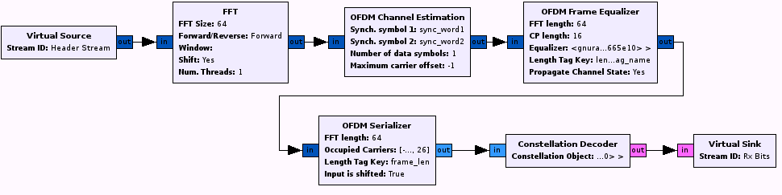

# whirlybird
Demo and tests field deployable approaches for &lt;200ms object inference from RF sourced, encrypted OFDM video transmissions.  

Orthogonal frequency-division multiplexing (OFDM) is a method of digital signal modulation in which a single data stream is split across several separate narrowband channels at different frequencies to reduce interference and crosstalk.  Whirlybird assumes dual band (2.4 and 5.8 GHz) reception of OFDM intermixed with frequency hopping spread spectrum which is used for drone control.  

## Initial Requirements RF to ByteStream   
Identify the strongest OFDM centerband transmission  
Use an FFT to shift the OFDM symbols into the frequency domain  
Identify the OFDM signal parameters for coarse frequency correction and channel estimation  
Correct for fine frequency offset  
Capture the packet stream  
Remove the cyclic prefix  
Demux the header    
Perform forward error correction on the stream  
Serialize the data stream  

## Sample Implementation using GNURadio  
  
